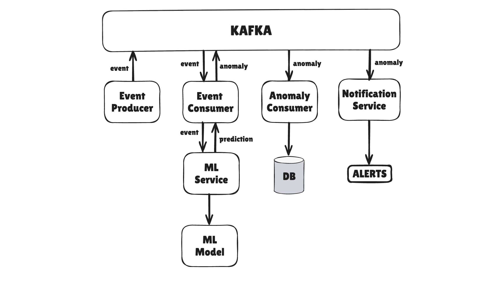

# Anomaly Detection for Login Events

Anomaly Detection is a production-ready, containerized microservices project for detecting anomalies in login events using machine learning. This system is designed for extensibility and reliability, making it suitable as an authentication security layer for any modern application.

---

## Architecture

The system is organized as a set of Dockerized microservices, each running in its own container and communicating via Kafka and Postgres.




---

## Features

- **Real-time anomaly detection** for login events using ML models.
- **Multiple microservices**: event generation, event consumption, ML prediction, anomaly logging, notification, and UI.
- **Stream processing** with Kafka for scalable event ingestion and distribution.
- **Microservices architecture**: Each major function is containerized and independently deployable.
- **PostgreSQL integration**: All events and anomaly results are stored for auditing and analytics.
- **Pluggable ML Model**: Easily swap or upgrade the ML logic in `MLmodel/`.
- **API Service**: Exposes endpoints for querying event and anomaly data.
- **Automated database migrations** provided via scripts.
- **Event simulation and replay** for testing via `event_generator.py`.
- **Notification/Alerter service** (_Work in Progress_): Will support alerting for detected anomalies.
- **Modern web UI** (_Planned_): Vue-based frontend for visualization and management.
- **Full Docker Compose orchestration** for seamless local or cloud deployment.

---

## Tech Stack

- **Backend:** Python microservices
- **Frontend:** Vue.js (with plans for significant improvement)
- **Database:** PostgreSQL
- **Messaging:** Kafka
- **Containerization:** Docker & Docker Compose

---

## Getting Started

### Prerequisites

- [Docker](https://www.docker.com/get-started) and Docker Compose
- (Optionally) Python 3.x, Node.js for development or manual service runs
- [PostgreSQL](https://www.postgresql.org/) (auto-launched in Docker Compose)

### Setup

1. **Clone the repository**
   ```sh
   git clone https://github.com/shogunx2/anomaly-detection.git
   cd anomaly-detection
   ```

2. **Start the full stack**
   ```sh
   docker-compose up --build
   ```
   This will launch all microservices, Kafka, and Postgres in their own containers.

3. **(Optional) Generate test events**
   ```sh
   python event_generator.py
   ```

4. **Database Migrations**
   - Database migrations are handled via `migrate.py` and/or the `db_migrations/` directory.

### Configuration

- Adjust database credentials and other settings as needed in the Docker Compose environment or individual service configs.
- Kafka topics can be created/configured using `kafka-topic-create.sh`.

---

## Usage

<!--
Leave this section as a placeholder for now, as requested.
-->

---

## Intended Use

This project is designed as a production-ready anomaly detection system for login events, suitable for integration with authentication infrastructures. While production-robust, certain components (Notification Service, improved UI) are still under development and may require further enhancements for mission-critical use.

---

## Roadmap

- [ ] Complete Notification Service for real-time alerting
- [ ] Enhance and productionize the web UI (Vue/JS)
- [ ] Add authentication and RBAC to the API service
- [ ] Expand ML model options and support for online learning
- [ ] Monitoring and observability improvements (Grafana, Prometheus, etc.)

---

## Contributing

Contributions, bug reports, and suggestions are welcome! Please open an issue or submit a pull request.

---

## License

This project is open source and available under the [MIT License](LICENSE).

---

**For a detailed view of all microservices and code, [browse the repository](https://github.com/shogunx2/anomaly-detection/contents/).**
